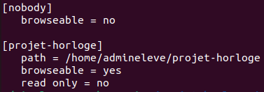
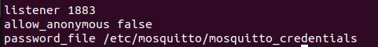

# CONFIGURATION RASPBERRY PI 4 AFFICHAGE

## MISES A JOUR:

Pour la raspberry\
`sudo apt update`\
`sudo apt upgrade`

Pour un projet Node.js\
`npm install`

Pour un environnement Python\
pas de commande :/

## SERVEUR PARTAGE DE FICHIERS SAMBA:

> Pour modifier le code facilement depuis n’importe quel ordinateur.\

Installation de Samba.\
`sudo apt install samba`

Configuartion du dossier de projet et masquage des dossiers par défaut inutiles.\
`sudo nano /etc/samba/smb.conf`\

Setup credentials.\
`sudo smbpasswd -a admineleve`

## BROKER MQTT MOSQUITTO:

[Setup and Install Mosquitto Broker- Raspberry Pi4 as MQTT Server](https://youtu.be/BFyPzC6No8k?si=yaYbwkmueGrIWXSd)\
[Setting up User name and password for Mosquitto Mqtt Broker](https://youtu.be/fknowuQJ9MA?si=DsKx_oQQzqU5aEiB)

> Pour faire le broker MQTT.

Installation de Mosquitto.\
`sudo apt install mosquitto mosquitto-clients`

Pour que Mosquitto se lance quand la raspberry démarre.\
`sudo systemctl enable mosquitto.service`

Précision du port et de l'usage obligatoire de credentials.\
`sudo nano /etc/mosquitto/mosquitto.conf`\

Setup credentials.\
`sudo mosquitto_passwd -c /etc/mosquitto/mosquitto_credentials admineleve`

## GIT:

[Git Tutorial For Dummies](https://youtu.be/mJ-qvsxPHpY?si=GAC6qJtvvqqgGeE5)\
[How to ignore node_modules in Git?](https://youtu.be/rvndnqFtMM8?si=01Ux7OH_qp97oBZz)\
[Git It? How to use Git and Github](https://youtu.be/HkdAHXoRtos?si=RcD2uHCtQeXyChwc)\
[Git for Professionals Tutorial - Tools & Concepts for Mastering Version Control with Git](https://youtu.be/Uszj_k0DGsg?si=br6XSmKvCokl0ZO7)\
[Comment bien installer et configurer GIT ?](https://youtu.be/b9TGUG8rmeI?si=uTU4FV2dOvlCJBxZ)\
[Introduction à Git et Github](https://youtu.be/8bC9M50WT1Q?si=i52kIIFUp5t3arvk)

> Pour versionner le projet, en gros.

Pour cloner le projet depuis GitHub.\
`git clone https://github.com/RUTAAA/projet-horloge.git`

Pour un projet avec Git.\
`git init`

Configurer Git pour le projet.\
`git config user.name "Lucas LB"`\
`git config user.email leborloch.l@stjolorient.fr`

Pour enregistrer toutes les modifications.\
`git add .`\
`git commit -m “commenter sur les modifications effectuées"`

Initialiser le dépôt distant.\
`git remote add origin https://github.com/RUTAAA/projet-horloge.git`

Pour sauvegarder les credentials du prochain push.\
`git config credential.helper store`

Pour envoyer les mofications sur le dépôt distant.\
`git push`

Pour mettre à jour le dépôt local avec le dépôt distant.\
`git pull`

> Manque la gestion de branches et des merges.

## NODE.JS ET NPM:

Node.js pour faire tourner du JavaScript en local.\
`npm pour installer des modules en JavaScipt.`

Installation de Node.js et npm.\
`sudo apt install nodejs`\
`sudo apt install npm`

## PYTHON ET PIP:

[Raspberry Pi Documentation - Python on Raspberry Pi](https://www.raspberrypi.com/documentation/computers/os.html#python-on-raspberry-pi)

Lancer un script Python.\
`python3 script.py`

Pour installer un packet Python avec APT (machine wide).\
`sudo apt install python3-nom-du-packet`

Installer un packet machine wide avbec pip est dangereux mais cela peut être fait.\
`pip install nom-du-packet --break-system-packages`

Nous utiliserons plutôt un environnement virtuel Python. Création d'un.\
`python -m venv nom-environnement`

Puis on l'active pour l'utiliser.\
`source nom-environnement/bin/activate`

Une fois dedans on peut installer des packet et lancer des programmes Python.\
`pip install nom-du-packet`\
`python3 script.py`

Pour le désactiver.\
`deactivate`

## PROJET:

Création du projet horloge.
mkdir ~/projet_horloge
cd ~/projet_horloge

Son arborescence est à détailler.

### APPLICATION HORLOGE:

Initialisation du projet avec npm.
npm init -y

Création de l'application expo, pour faire du React Native.
npm install create-expo-app –save
npx create-expo-app

Allons dans le dossier de l'application.
cd projet_horloge_affichage

Installation d’un module pour créer des diagrammes circulaires en React native, cela servira pour faire l’horloge.
npm install react-native-pie-chart

Pour lancer l'application.
npm run web
npm run android
npm run ios

### API BASE DE DONNEES:

[#1 Localhost Mysql Fetch || React Native || with Express || Nodejs](https://youtu.be/ztTM50ZuKNo?si=1PKbUbIeFN3MngUk)
[RESTful APIs in 100 Seconds // Build an API from Scratch with Node.js Express](https://youtu.be/-MTSQjw5DrM?si=mDwYJAMdDAM92gAj)

Création du dossier de l'API
mkdir ~/projet_horloge/projet_horloge_api
cd ~/projet_horloge/projet_horloge_api

Initialisation du projet avec npm.
npm init -y

Installation de modules utiles.
npm i express
npm i mysql
npm i cors

Pour lancer l'API.
node app.js

Je n'ai pas expliqué la modification du module react-native-pie-chart.
Je n'ai pas expliqué non plus le MQTT et la synthèse vocale que j'ai fait avec Python.
